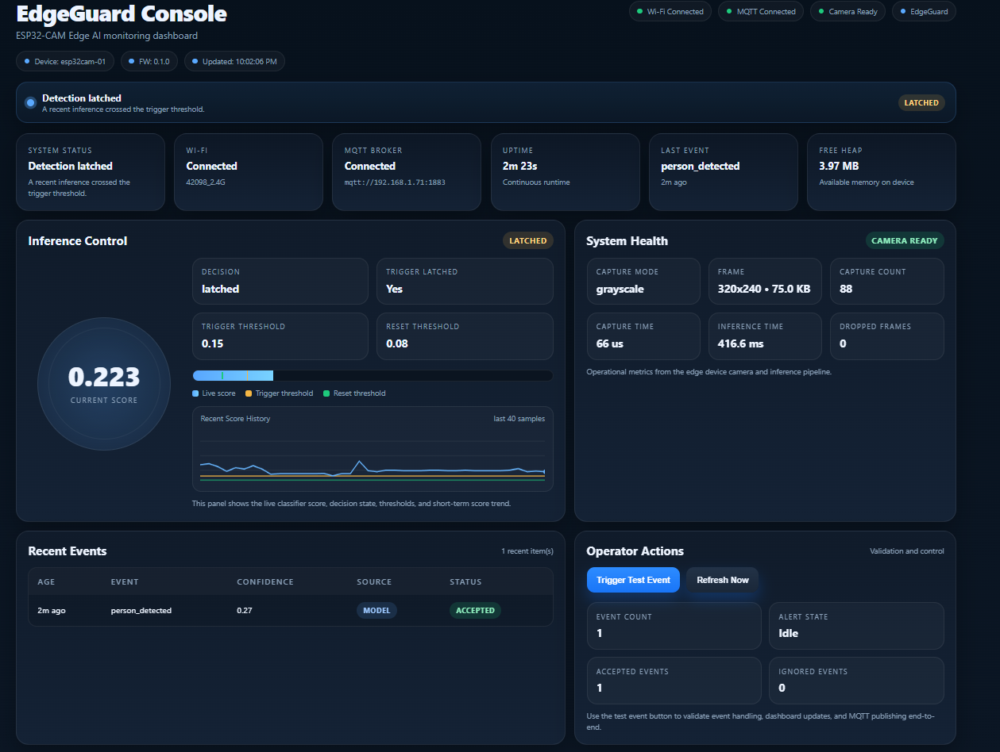

# EdgeGuard

ESP32-CAM edge AI security prototype that performs on-device person detection, raises local alerts, and publishes MQTT events to a local dashboard.



## Overview

EdgeGuard is an end-to-end edge AI + IoT project built around the ESP32-CAM and ESP-IDF. The system captures camera frames, preprocesses them into a lightweight grayscale tensor, runs an INT8 TFLite Micro classifier on-device, and triggers a `person_detected` event when the confidence crosses a tuned threshold.

The project was designed to demonstrate the full embedded AI lifecycle:

- firmware architecture in ESP-IDF
- camera data collection on device
- dataset curation and training in Google Colab
- INT8 model export and firmware embedding
- real-time inference on ESP32-CAM
- local web dashboard for observability
- MQTT telemetry and event publishing

## Why this project matters

Most “AI at the edge” demos stop at model training. EdgeGuard goes further by showing how to ship an embedded AI pipeline as a working system:

- camera capture and preprocessing
- TFLite Micro runtime integration
- event-driven firmware
- telemetry and monitoring
- operator-facing dashboard
- resource-aware deployment on constrained hardware

## Features

- **On-device person detection** using a compact INT8 TFLite Micro model
- **ESP32-CAM grayscale inference pipeline** optimized for embedded deployment
- **Event-driven architecture** with separate camera, inference, MQTT, alert, and web modules
- **MQTT publishing** for health telemetry and `person_detected` events
- **Production-style embedded dashboard** with:
  - live inference score
  - decision and latch state
  - score history sparkline
  - recent events table
  - system health metrics
  - operator actions
- **Local visual observability** without depending on cloud infrastructure
- **Threshold tuning workflow** from Colab to firmware deployment

## System architecture

```text
ESP32-CAM
 ├── Camera Service
 │    └── captures 320x240 grayscale frames
 ├── Preprocess
 │    └── resizes to 64x64 grayscale tensor
 ├── Inference Engine
 │    └── runs INT8 TFLite Micro model
 ├── Event Manager
 │    └── emits person_detected events
 ├── LED Alert
 │    └── local visual signal
 ├── MQTT Service
 │    ├── publishes health
 │    └── publishes events
 └── Web Server
      └── serves EdgeGuard dashboard
```

## Firmware modules

```text
firmware/
├── main/
├── components/
│   ├── camera_service/
│   ├── inference_engine/
│   ├── event_manager/
│   ├── mqtt_service/
│   ├── network_manager/
│   ├── led_alert/
│   ├── storage/
│   └── web_server/
└── managed_components/
```

## ML pipeline

1. Capture labeled images from the ESP32-CAM
2. Build `person` vs `empty` dataset
3. Train lightweight classifier in Google Colab
4. Export float and INT8 TFLite models
5. Tune threshold on validation data
6. Convert INT8 model to C array
7. Embed model into firmware
8. Run live inference on-device

## Deployment details

- **Board:** ESP32-CAM
- **Framework:** ESP-IDF
- **Runtime:** TensorFlow Lite Micro
- **Inference mode:** 64x64 grayscale
- **Model:** INT8 binary classifier (`person` vs `empty`)
- **Alert transport:** MQTT + local LED alert
- **UI:** lightweight embedded HTML/CSS/JS dashboard served from device

## Current dashboard metrics

The dashboard exposes:

- Wi-Fi and MQTT connection state
- uptime and last event
- current inference score
- trigger and reset thresholds
- latched / monitoring state
- capture mode, capture count, dropped frames
- inference latency
- recent event history
- free heap / device health

## Example event flow

```text
frame capture
→ grayscale resize
→ TFLite Micro inference
→ score threshold check
→ person_detected event
→ dashboard update
→ MQTT publish
→ LED alert
```

## Key engineering learnings

- managing constrained memory while running camera + Wi-Fi + inference
- choosing grayscale over JPEG for the live inference path
- separating runtime validation from preprocessing validation
- tuning inference thresholds for real-world deployment, not just notebook accuracy
- designing a lightweight operator dashboard that fits embedded constraints

## Results

- live on-device inference running on ESP32-CAM
- stable `person_detected` event pipeline
- MQTT health and event publishing
- production-style embedded dashboard
- end-to-end AI + IoT workflow demonstrated on real hardware


## Future improvements

- add configurable thresholds from the dashboard
- add event export and persistent logs
- add camera preview/debug mode
- evaluate ESP-NN / further latency optimizations
- add OTA model update workflow
- connect to cloud backend for remote fleet monitoring
